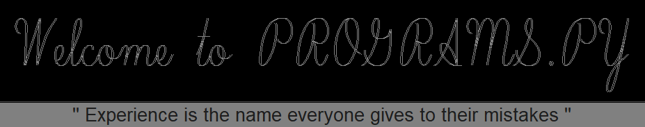
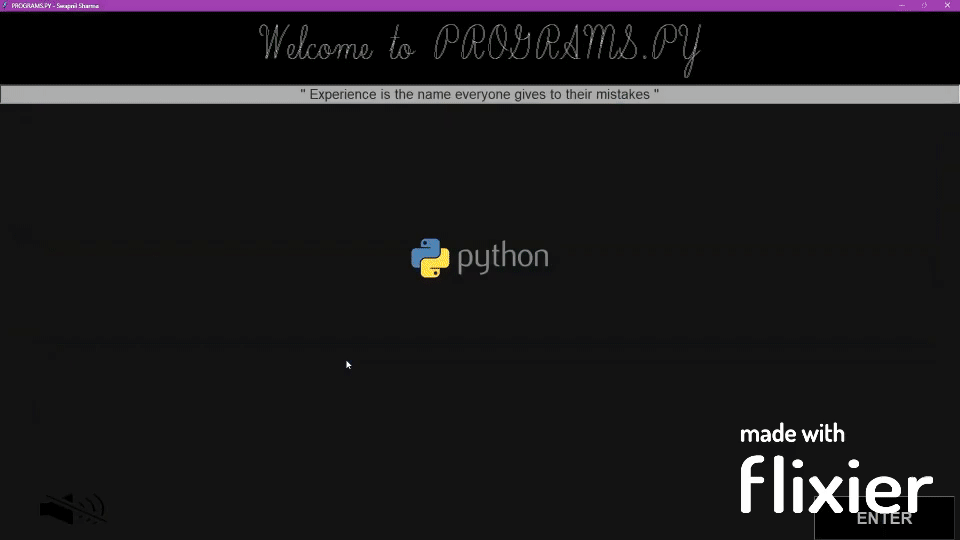
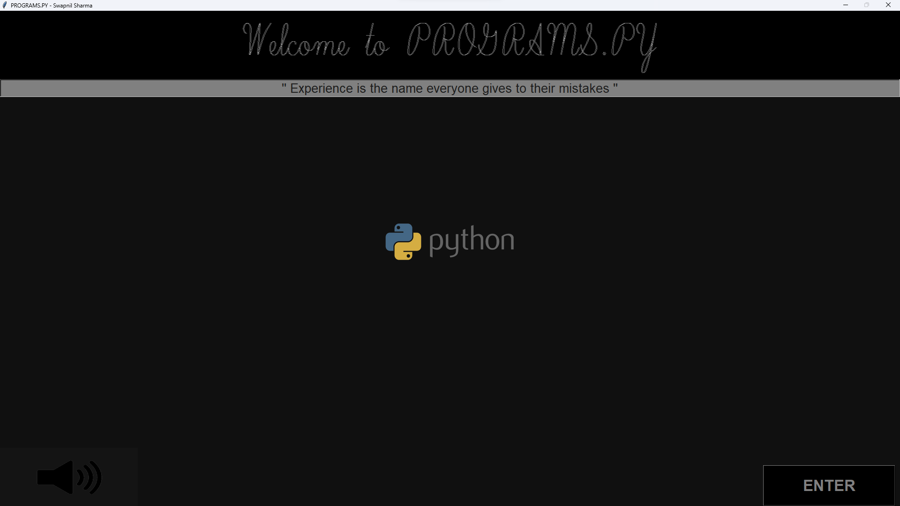
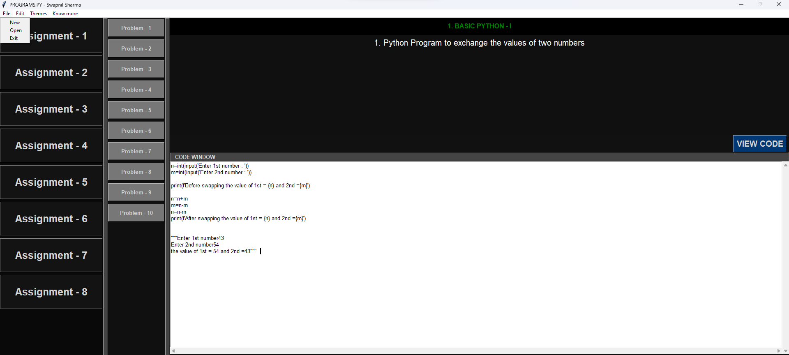
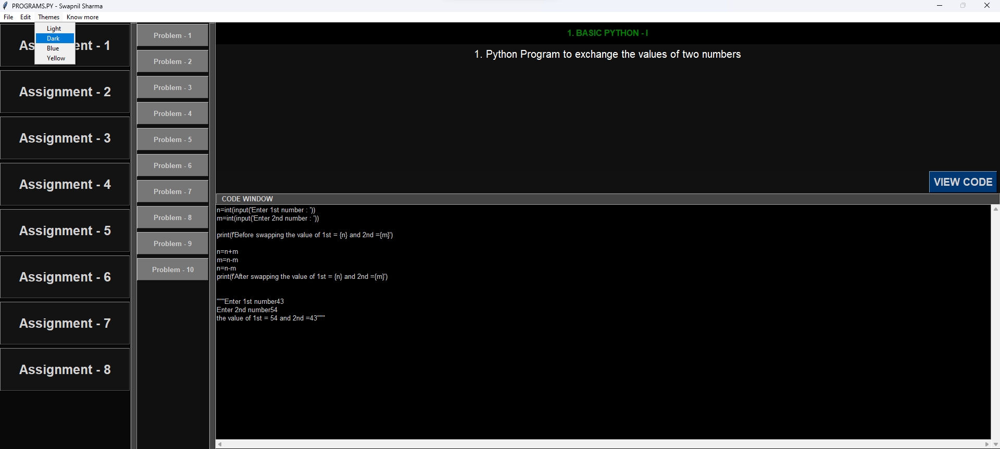

# Programs.py


A software with a graphical user interface is provided to aid users in their Python practice. This coding environment allows for music playback while they code, creating an enjoyable and productive experience.

## Features
- Graphical user interface for a seamless coding experience.
- Music playback feature to enhance focus and productivity.
- Interactive code editor with syntax highlighting.
- Automatic code formatting and error detection.
- Built-in Python documentation for quick reference.
- Easy integration with popular Python libraries and modules.
- Code execution and immediate feedback.

## Video Demonstration
[](https://youtu.be/ajzVwmDh0U4)

Click the gif above to watch full video demonstration of the project on YouTube.

## Screenshots




## Usage
1. Clone the repository:
   ```bash
   https://github.com/Swapnil-11-04-01/ProgramsPy.git
   ```
3. Click Start.exe
